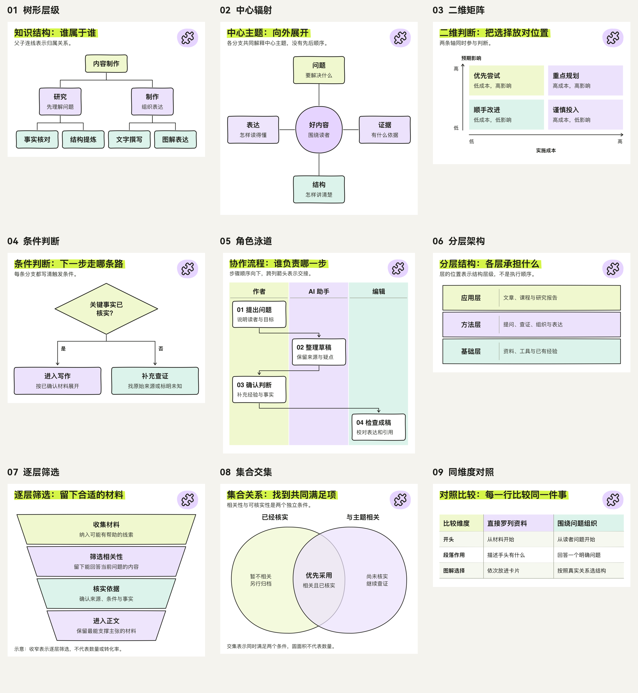

# 手绘信息图表

把文章、书籍、课程和报告里的内容，画成清楚、可编辑的彩色手绘信息图。先判断信息之间的关系，再选择结构，最后应用统一的视觉风格。

白底、荧光绿与紫色强调、浅彩色块、黑色手绘线稿，搭配端正的印刷文字。输出 **SVG + PNG**，分别放在两个文件夹中；SVG 文字保留为真实 `<text>`，可继续编辑。



## 能画什么

| 内容关系 | 内置结构 |
| --- | --- |
| 独立要点、执行顺序、少量独立面板、循环、事件历程 | cards / steps / compare / cycle / timeline |
| 谁属于谁，如何逐层拆解 | tree：树形层级 |
| 一个主题有哪些侧面 | radial：中心辐射 |
| 两个标准共同决定位置 | matrix：二维矩阵 |
| 满足条件后走哪条路 | decision：条件判断 |
| 谁负责，在哪里交接 | swimlane：角色泳道 |
| 各层分别承担什么 | layers：分层架构 |
| 如何逐层筛选、收敛 | funnel：定性筛选漏斗 |
| 哪些内容同时满足两个条件 | venn：集合交集 |
| 两种方案在相同维度上有什么差异 | table：同维度对照表 |

共 14 种内置结构。另有 [20 类信息关系选型库](references/structure-library.md)，帮助判断何时需要并行汇合、嵌套、概念网络、鱼骨图、部件标注或数据图。复杂结构需按内容定制；内置漏斗不表示真实人数或转化率，集合圆面积不表示数量。

## 安装

从 [整活 Skills 仓库](https://github.com/ai798-Lab/zhenghuo-skills) 下载代码，将整个 `handdrawn-infographics` 文件夹放入所用工具的 Skill 目录，保留 `scripts/`、`assets/`、`references/` 和 `agents/`：

| 工具 | 本仓库采用的安装位置 |
| --- | --- |
| Codex | `~/.codex/skills/handdrawn-infographics/` |
| Claude Code | `~/.claude/skills/handdrawn-infographics/` |

绘图脚本在本地运行，需要 Python 3.10+ 与 fontTools、Node.js 与 sharp、fontconfig（`fc-match`），以及已安装的 HarmonyOS Sans SC 常规体和粗体。字体不随仓库分发；替换字体时需要重新测量并检查成图。实际依赖路径与参数见 [生成器说明](references/renderer.md)。

## 使用

向 AI 工具提供内容，并说明：

> 使用 handdrawn-infographics，把下面的内容画成适合手机阅读的手绘信息图。先根据内容关系选结构，输出可编辑 SVG 和 PNG。

也可以明确读者问题：

> 把作者、AI 助手、编辑之间的交接画成泳道图，保留每一步的责任归属。

> 将这两种方案按成本、适用条件和限制逐项对照，使用相同维度对齐的表格。

书籍默认按 144mm 图宽安排字号；文章默认按手机阅读安排更大的相对字号。长流程控制密度，树、矩阵和泳道保留自己的信息关系。长标签需要逐图检查语义断行。

依赖就绪后，可以在此目录直接运行九种结构示例：

```sh
python3 scripts/build.py assets/examples/structures.json --out output/structures
```

产物位于 `output/structures/SVG/` 和 `output/structures/PNG/`。默认拒绝覆盖同名文件；输入规范、字体参数和重新导出方式见 [生成器说明](references/renderer.md) 与 [结构输入](references/structure-inputs.md)。

## 文件与参考

- [SKILL.md](SKILL.md)：AI 使用本技能的入口。
- [风格与阅读规范](references/style-guide.md)：颜色、字体、字号和阅读尺度。
- [结构选型库](references/structure-library.md)：根据读者问题选择结构。
- [研究来源](references/research-sources.md)：Visme、NN/g、Lucidchart、ASQ、FT 等方法资料。
- `assets/examples/`：风格样图、结构总览和可运行输入。
- `scripts/`：SVG 排版、文字检查与 PNG 导出。

生成器已在 macOS 上完成新结构、手机宽度预览和旧版兼容检查。跨机器使用仍需满足字体与依赖条件；程序检查不能代替实际查看图片。

## 许可

代码与文档遵循仓库的 [MIT 许可](LICENSE)。手绘图标来自 sketchyicons 使用的 Lucide / Feather 派生几何，保留其 ISC / MIT 声明，见 [第三方图标许可](assets/NOTICE-sketchyicons.txt)。
