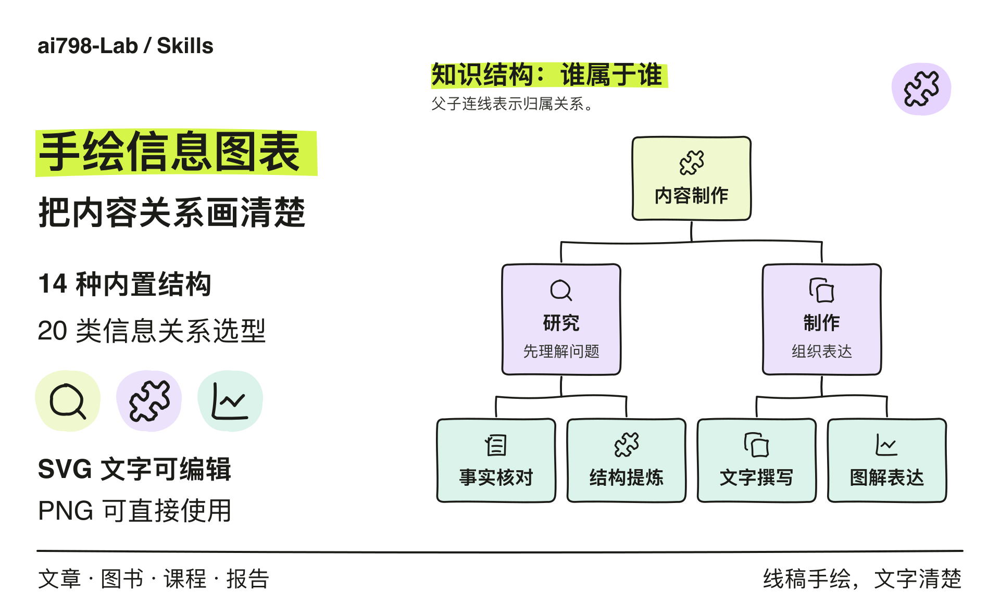

# 手绘信息图表

把文章、书籍、课程和报告里的内容，画成清楚、可编辑的彩色手绘信息图。先看内容关系，再选择构图：归属用树，条件用分支，协作用泳道，比较按维度对齐。

[查看九种结构示例](assets/examples/README.md) · [安装](#安装) · [使用](#使用) · [结构选型](references/structure-library.md)

<picture>
  <source media="(max-width: 640px)" srcset="assets/showcase/PNG/hero-mobile.png">
  
</picture>

- **线条和图标都保留手绘感。** 浅绿、浅紫、浅青与浅橙色块，搭配黑色曲线笔触；正文图标与内容含义对应。
- **文字端正、清楚、可编辑。** SVG 保留真实文字节点，PNG 从同一份 SVG 导出，分别放入 `SVG/`、`PNG/` 文件夹。
- **结构跟着内容走。** 支持 14 种内置结构，配套 20 类信息关系选型。坐标轴和数据位置保持准确，手绘笔触不改变信息含义。

## 看效果

下面是实际生成的文章版二维矩阵。图标、边框和连接使用手绘线稿，文字保留印刷字体；两个判断维度都明确标在坐标轴上。


[查看这张图的可编辑 SVG](assets/examples/SVG/matrix-article.svg) · [打开 PNG 原图](assets/examples/PNG/matrix-article.png)

[完整示例页](assets/examples/README.md) 按“知识与组织”“判断与选择”“协作与关系”分组展示九种构图，每张都提供文章版和书籍版的 SVG／PNG。[九图总览](assets/examples/structure-gallery.png) 用于快速比较构图，单张示例适合看文字与线稿细节。

## 能画什么

| 内容关系 | 内置结构 |
| --- | --- |
| 独立要点、执行顺序、少量独立面板、循环、事件历程 | cards / steps / compare / cycle / timeline |
| 谁属于谁，如何逐层拆解 | tree：树形层级 |
| 一个主题有哪些侧面 | radial：中心辐射 |
| 两个标准共同决定位置 | matrix：二维矩阵 |
| 满足条件后走哪条路 | decision：条件判断 |
| 谁负责，在哪里交接 | swimlane：角色泳道 |
| 各层分别承担什么 | layers：分层架构 |
| 如何逐层筛选、收敛 | funnel：定性筛选漏斗 |
| 哪些内容同时满足两个条件 | venn：集合交集 |
| 两种方案在相同维度上有什么差异 | table：同维度对照表 |

共 **14 种可直接生成的结构**。另有 [20 类信息关系选型库](references/structure-library.md)，帮助判断何时需要并行汇合、嵌套、概念网络、鱼骨图、部件标注或数据图；选型库并不等于 20 个现成模板。

内置判断图支持一个判断点，泳道支持顺序交接，中心辐射支持一层展开；更复杂的关系需要定制布局。漏斗仅表示定性筛选，集合圆面积不表示数量。

## 安装

从 [整活 Skills 仓库](https://github.com/ai798-Lab/zhenghuo-skills) 的 **Code → Download ZIP** 下载代码，将整个 `handdrawn-infographics` 文件夹放入所用工具的 Skill 目录，保留 `scripts/`、`assets/`、`references/` 和 `agents/`：

| 工具 | 本仓库采用的安装位置 |
| --- | --- |
| Codex | `~/.codex/skills/handdrawn-infographics/` |
| Claude Code | `~/.claude/skills/handdrawn-infographics/` |

绘图脚本在本地运行，需要 Python 3.10+ 与 fontTools、Node.js 与 sharp、fontconfig（`fc-match`），以及已安装的 HarmonyOS Sans SC 常规体和粗体。字体不随仓库分发；替换字体时需要重新测量并检查成图。实际依赖路径与参数见 [生成器说明](references/renderer.md)。

## 使用

向 AI 工具提供内容，并说明：

> 使用 handdrawn-infographics，把下面的内容画成适合手机阅读的手绘信息图。先根据内容关系选结构，输出可编辑 SVG 和 PNG。

也可以明确读者问题：

> 把作者、AI 助手、编辑之间的交接画成泳道图，保留每一步的责任归属。

> 将这两种方案按成本、适用条件和限制逐项对照，使用相同维度对齐的表格。

书籍默认按 144mm 图宽安排字号；文章默认按手机阅读安排更大的相对字号。长流程控制密度，树、矩阵和泳道保留自己的信息关系。长标签需要逐图检查语义断行。

依赖就绪后，可以在此目录运行书籍版或文章版示例：

```sh
python3 scripts/build.py assets/examples/structures.json --out output/structures
python3 scripts/build.py assets/examples/articles.json --out output/articles
```

每个输出目录都包含 `SVG/` 和 `PNG/`。默认拒绝覆盖同名文件；输入规范、字体参数和重新导出方式见 [生成器说明](references/renderer.md) 与 [结构输入](references/structure-inputs.md)。

**修改文字：** 优先修改 JSON 内容再生成，生成器会重新测量文字和安排空间。也可以在支持 SVG 的编辑器中修改文字；改长文后需要重新检查换行和遮挡，再从修改后的 SVG 导出 PNG。编辑 SVG 的机器需要安装相应字体；使用 PNG 无需安装字体。

绘图与字体检查由本地脚本完成，不需要图片生成 API Key。示例使用原创演示文案。使用 AI 工具整理内容时，正文如何传给模型仍取决于所用工具的设置。

## 本次更新

2026-09-27：恢复新增九种结构中的正文手绘图标与曲线笔触，保留文字可编辑和旧布局兼容性；更新 GitHub 主图、独立窄屏主图、九图总览和分组示例页。

维护布局时运行 `python3 scripts/test_style.py`，检查正文图标、显式图标选择、手绘连接和文章版集合图的字号，同时实际查看成图。桌面端与窄屏主图分别排版，九种结构同时提供可查看的文章版与书籍版示例。

## 文件与参考

- [SKILL.md](SKILL.md)：AI 使用本技能的入口。
- [风格与阅读规范](references/style-guide.md)：颜色、字体、字号和阅读尺度。
- [结构选型库](references/structure-library.md)：根据读者问题选择结构。
- [研究来源](references/research-sources.md)：Visme、NN/g、Lucidchart、ASQ、FT 等方法资料。
- [完整示例](assets/examples/README.md)：九种构图、18 套 SVG／PNG 和可运行输入。
- `assets/showcase/`：GitHub 主图的 SVG 母版与 PNG。
- `scripts/`：SVG 排版、文字检查与 PNG 导出。

生成器已在 macOS 上完成新结构、手机宽度预览和旧版兼容检查。跨机器使用仍需满足字体与依赖条件；程序检查不能代替实际查看图片。

## 许可

代码与文档遵循仓库的 [MIT 许可](LICENSE)。手绘图标来自 sketchyicons 使用的 Lucide / Feather 派生几何，保留其 ISC / MIT 声明，见 [第三方图标许可](assets/NOTICE-sketchyicons.txt)。
