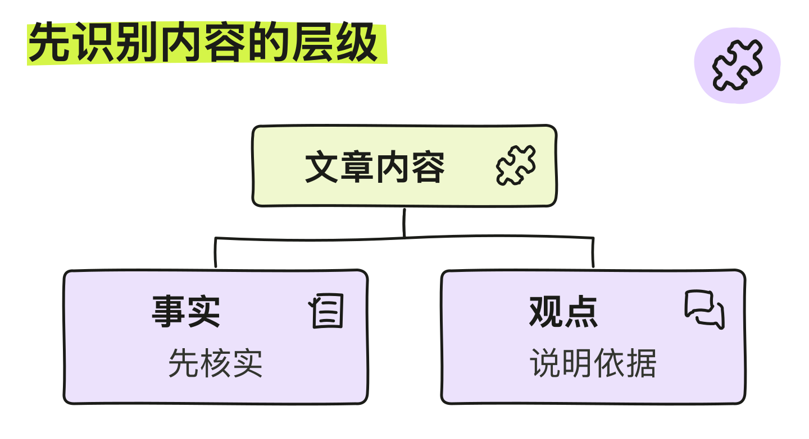
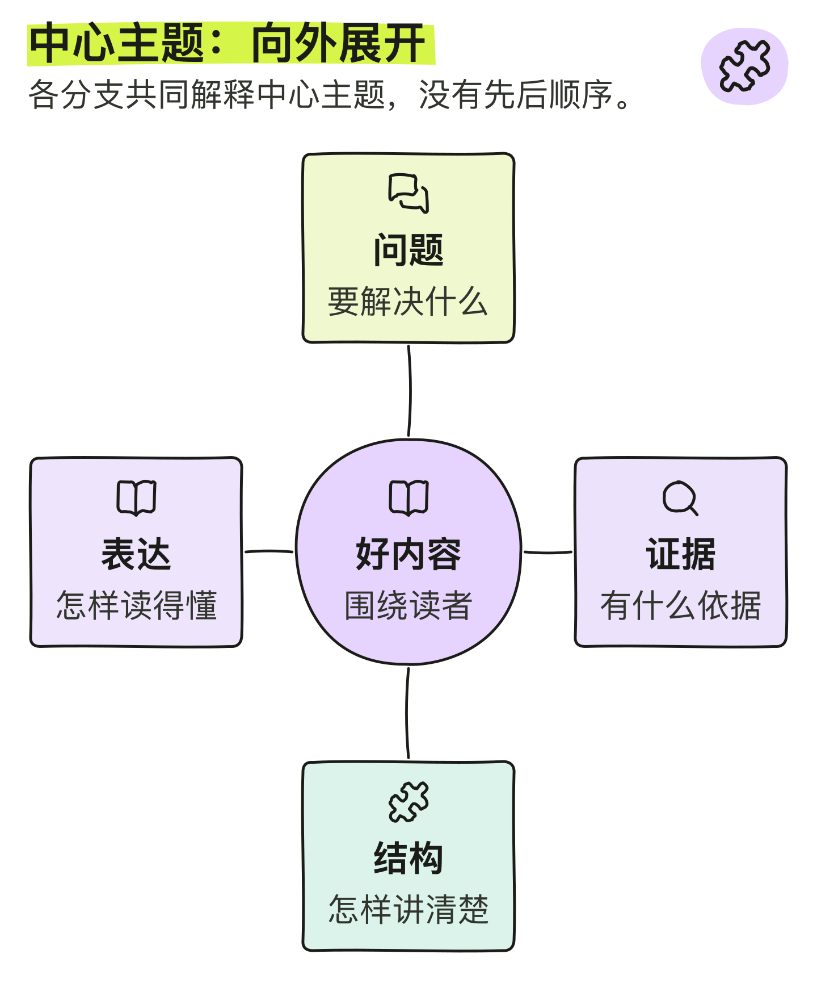
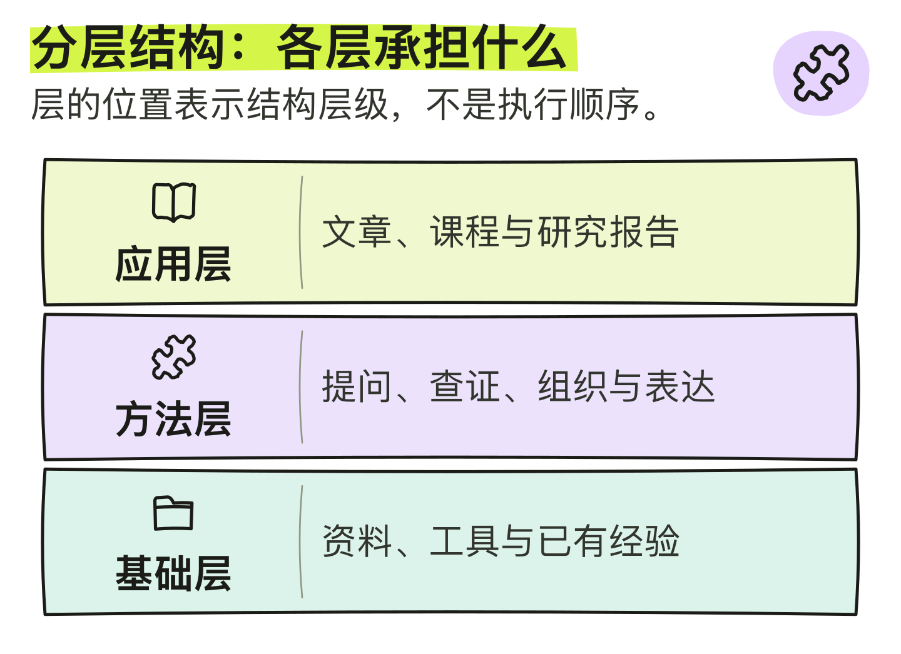
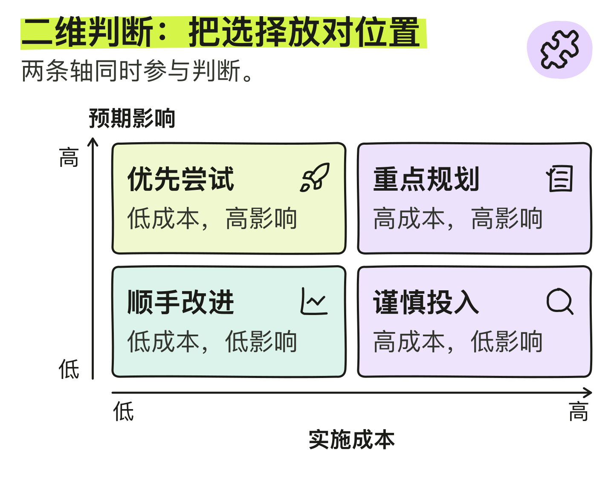
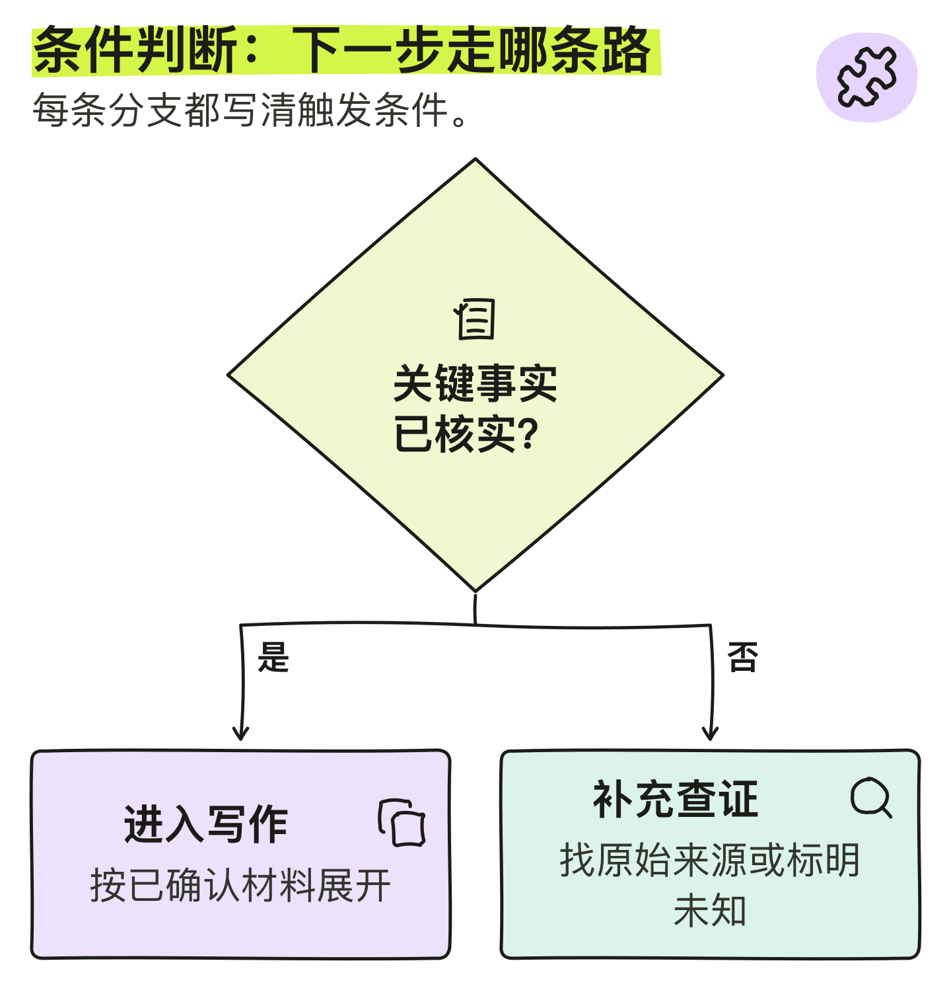
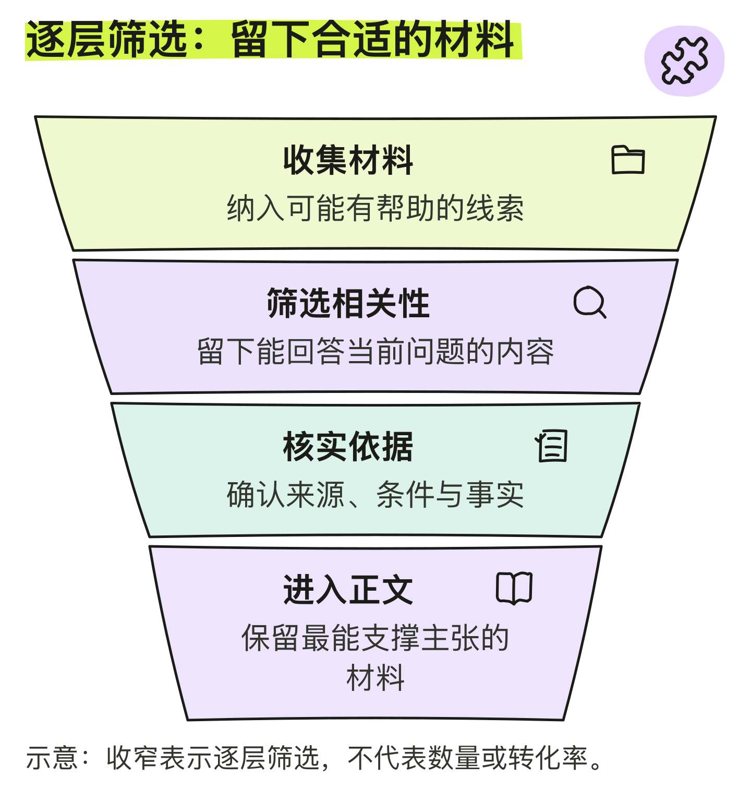
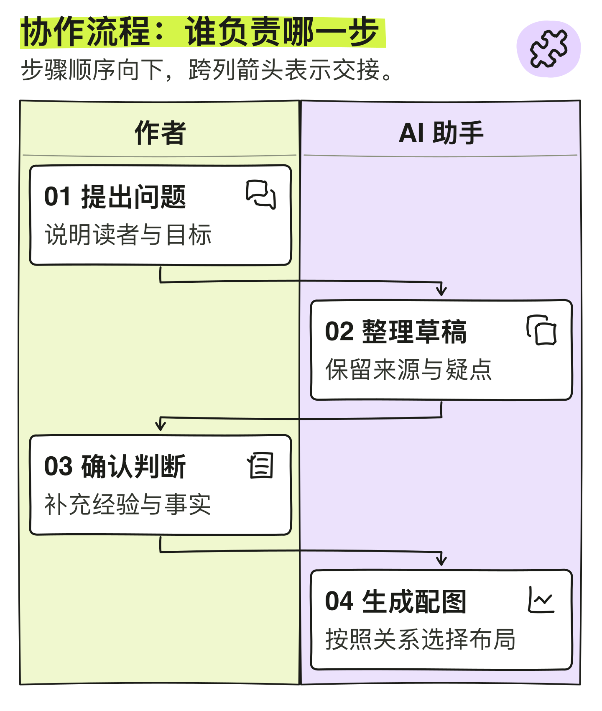
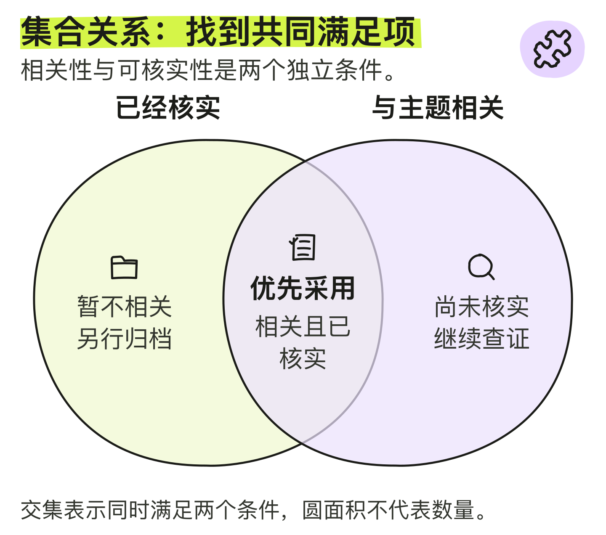
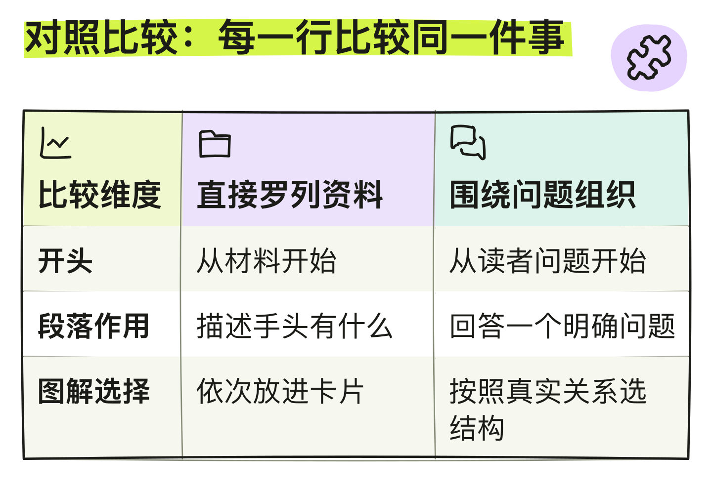

# 九种信息结构示例

[返回 Skill 介绍](../../README.md) · [九图总览](structure-gallery.png) · [书籍版输入](structures.json) · [文章版输入](articles.json)

以下均为本 Skill 实际生成的示例。页面展示字号较大的文章版；每张下方可打开文章版或书籍版的 SVG 与 PNG。文章版按阅读密度调整示例内容，保留图形要表达的关系。

图标与边框采用手绘线稿，文字为端正的印刷字体。SVG 可编辑，PNG 可直接使用；编辑 SVG 需要相应字体。

**按关系查看：** [知识与组织](#知识与组织) · [判断与选择](#判断与选择) · [协作与关系](#协作与关系)

## 知识与组织

### 树形层级

谁属于谁，如何逐层拆解。

文章版：[SVG](SVG/tree-article.svg) · [PNG](PNG/tree-article.png)

书籍版：[SVG](SVG/01-tree.svg) · [PNG](PNG/01-tree.png)

### 中心辐射

一个主题有哪些侧面。

文章版：[SVG](SVG/radial-article.svg) · [PNG](PNG/radial-article.png)

书籍版：[SVG](SVG/02-radial.svg) · [PNG](PNG/02-radial.png)

### 分层架构

不同层级分别承担什么。

文章版：[SVG](SVG/layers-article.svg) · [PNG](PNG/layers-article.png)

书籍版：[SVG](SVG/06-layers.svg) · [PNG](PNG/06-layers.png)

## 判断与选择

### 二维矩阵

两个标准如何共同影响判断。

文章版：[SVG](SVG/matrix-article.svg) · [PNG](PNG/matrix-article.png)

书籍版：[SVG](SVG/03-matrix.svg) · [PNG](PNG/03-matrix.png)

### 条件判断

不同条件分别走哪条路。

文章版：[SVG](SVG/decision-article.svg) · [PNG](PNG/decision-article.png)

书籍版：[SVG](SVG/04-decision.svg) · [PNG](PNG/04-decision.png)

### 逐层筛选

材料如何逐层收敛。

文章版：[SVG](SVG/funnel-article.svg) · [PNG](PNG/funnel-article.png)

书籍版：[SVG](SVG/07-funnel.svg) · [PNG](PNG/07-funnel.png)

## 协作与关系

### 角色泳道

谁负责哪一步，哪里发生交接。

文章版：[SVG](SVG/swimlane-article.svg) · [PNG](PNG/swimlane-article.png)

书籍版：[SVG](SVG/05-swimlane.svg) · [PNG](PNG/05-swimlane.png)

### 集合交集

哪些内容同时满足两个条件。

文章版：[SVG](SVG/venn-article.svg) · [PNG](PNG/venn-article.png)

书籍版：[SVG](SVG/08-venn.svg) · [PNG](PNG/08-venn.png)

### 同维度对照

两种方案在相同维度上有什么差别。

文章版：[SVG](SVG/table-article.svg) · [PNG](PNG/table-article.png)

书籍版：[SVG](SVG/09-table.svg) · [PNG](PNG/09-table.png)

## 使用提示

- 这些是原创演示文案，使用时换成自己的正文与事实。
- 漏斗表示定性筛选，不表示人数或转化率；集合圆面积不表示数量。
- 改长文时优先修改 JSON 再生成；手动修改 SVG 后需重新检查排版并导出 PNG。
- [生成器说明](../../references/renderer.md) · [结构输入](../../references/structure-inputs.md) · [第三方图标许可](../NOTICE-sketchyicons.txt)
